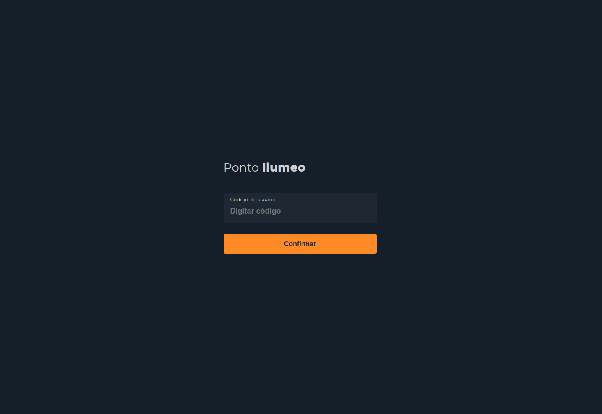

# Ponto Ilumeo APP
Esse case/teste faz parte do processo de recrutamento da empresa Ilumeo.

<br>

<p align="center">
  
</p>

<p align="center">
  
</p>

<br>

## Requerimentos

- [Node.js v16](https://nodejs.org/en/)


## Instalação

```bash
$ npm install
```

## Test

```bash
$ npm test
```

## Execução

```bash
ATENÇÃO! RENOMEAR ARQUIVO .env.local.example PARA .env.local E INSERIR URL DA API EM 'VITE_API_URL'

$ npm run dev
```

## Produção

```bash
$ npm run build
```

## :memo: License

This project is under the MIT license. See the [LICENSE](LICENSE.md) file for more details.

---

Feito por Renan Lisboa :wave:
